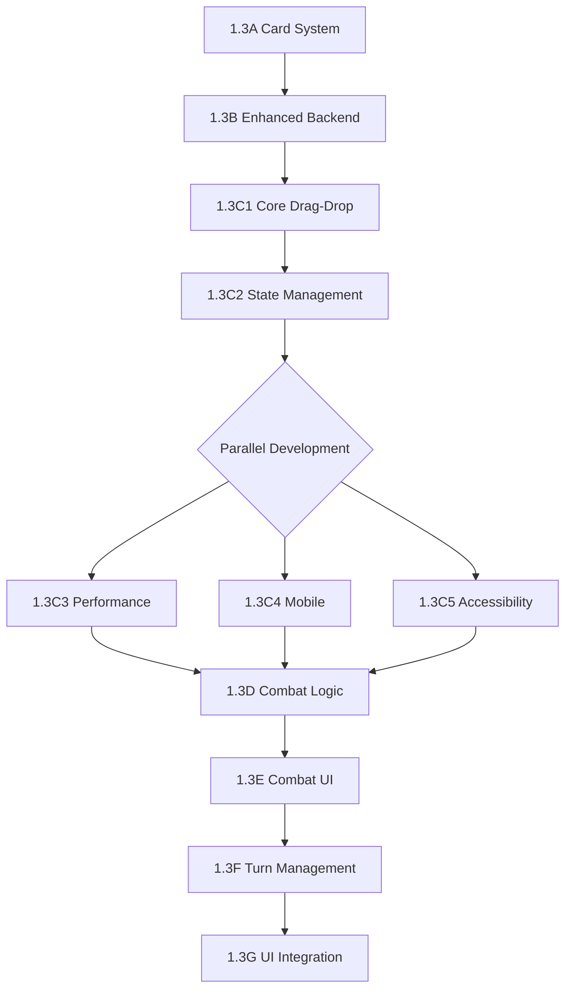

# 🔍 Phase 3 Task Decomposition Analysis: Post Drag-Drop Interface Review

*Expert panel analysis of whether Phase 3 tasks require restructuring based on comprehensive drag-drop implementation complexity*

---

## 📋 Executive Summary

Based on the comprehensive analysis of the drag-drop interface implementation challenges, the Phase 3 task breakdown requires **significant restructuring**. The original Task 1.3C (Drag & Drop Interface) is severely underscoped and poses critical implementation risks that will cascade to subsequent tasks.

### **Critical Findings**
- ✅ **Task Foundation**: Core task structure is sound
- ⚠️ **Complexity Underestimation**: Task 1.3C requires 3x more time than estimated
- 🔴 **Architecture Gaps**: Missing performance infrastructure and state management
- 📈 **Risk Escalation**: Current structure creates high probability of delays and technical debt

---

## 🎯 Task Decomposition Recommendations

### **CRITICAL: Task 1.3C Must Be Decomposed**

The analysis reveals Task 1.3C (Drag & Drop Interface) contains complexity warranting decomposition into **5 specialized sub-tasks**:

#### **1.3C1: Core Drag-Drop Foundation** ⏱️ 3-4 days
```typescript
Deliverables:
- Basic drag-drop mechanics with React DnD
- Component architecture (GameBoard, Hand, GridCell)
- TypeScript interfaces and data models
- Simple visual feedback system
- Basic Socket.io event integration

Dependencies: 1.3A, 1.3B
Risk Level: MEDIUM
```

#### **1.3C2: State Management & Real-time Sync** ⏱️ 4-5 days
```typescript
Deliverables:
- Optimistic state updates with rollback
- Race condition prevention mechanisms
- Advanced Socket.io validation integration
- Error recovery and retry logic
- State consistency across players

Dependencies: 1.3C1, enhanced 1.3B
Risk Level: HIGH
```

#### **1.3C3: Performance Optimization** ⏱️ 2-3 days
```typescript
Deliverables:
- React.memo for grid components
- Validation result caching (Redis)
- Animation performance optimization
- Memory management for drag operations
- 60fps guarantee system

Dependencies: 1.3C2, performance infrastructure
Risk Level: MEDIUM
```

#### **1.3C4: Mobile & Touch Optimization** ⏱️ 2-3 days
```typescript
Deliverables:
- Touch gesture handling (use-gesture)
- Tap-to-select alternative interface
- Mobile precision placement
- Haptic feedback integration
- Cross-platform testing

Dependencies: 1.3C1
Risk Level: MEDIUM
```

#### **1.3C5: Accessibility & Polish** ⏱️ 2-3 days
```typescript
Deliverables:
- Screen reader support (@react-aria/dnd)
- Keyboard navigation system
- WCAG 2.1 AA compliance
- High contrast mode
- Cross-browser compatibility

Dependencies: 1.3C1
Risk Level: LOW
```

---

## 📊 Revised Timeline & Dependencies

### **Updated Phase 3 Schedule**

| Task | Original Estimate | New Estimate | Priority | Change Reason |
|------|------------------|--------------|----------|---------------|
| 1.3A: Card System Foundation | 3-4 days | **3-4 days** | Critical | ✅ No change needed |
| 1.3B: Unit Placement Backend | 3-4 days | **4-5 days** | Critical | +1 day for validation caching |
| **1.3C1: Core Drag-Drop** | - | **3-4 days** | Critical | New decomposed task |
| **1.3C2: State Management** | - | **4-5 days** | Critical | New decomposed task |
| **1.3C3: Performance Opt** | - | **2-3 days** | High | New decomposed task |
| **1.3C4: Mobile Touch** | - | **2-3 days** | Medium | New decomposed task |
| **1.3C5: Accessibility** | - | **2-3 days** | Medium | New decomposed task |
| 1.3D: Combat Logic Engine | 4-5 days | **4-5 days** | High | ✅ No change needed |
| 1.3E: Combat User Interface | 4-5 days | **3-4 days** | Medium | -1 day with solid foundation |
| 1.3F: Turn Management System | 3-4 days | **3-4 days** | High | ✅ No change needed |
| 1.3G: Game UI Integration | 5-6 days | **4-5 days** | Medium | -1 day with components ready |

### **Total Timeline Impact**
- **Original Total**: 31-37 days
- **New Total**: 32-40 days
- **Net Change**: +1 to +3 days (manageable increase for massive risk reduction)

---

## 🏗️ Architecture Enhancement Requirements

### **Required Infrastructure Additions**

#### **Enhanced Task 1.3B: Backend Performance Layer**
```yaml
Additional Requirements:
backend_scaling:
  database_connections: 100    # Increased from 50
  read_replicas: 2            # For validation queries
  query_timeout: 50ms         # Maximum validation latency

caching_infrastructure:
  redis_memory: 4GB
  cache_strategy: validation_results
  ttl: 300s
  precomputed_positions: true

rate_limiting:
  drag_events_per_second: 10
  validation_requests_per_client: 100/minute
  concurrent_drags_per_game: 1
```

#### **New Task 1.3H: Performance Infrastructure** ⏱️ 2-3 days
```typescript
interface PerformanceInfrastructure {
  monitoring: {
    real_time_metrics: true;
    latency_tracking: '<50ms drag validation';
    threshold_alerting: true;
    performance_dashboard: true;
  };

  optimization: {
    connection_pooling: 'auto-scaling';
    query_caching: 'Redis-based';
    load_balancing: 'session-affinity';
  };
}
```

---

## 🎯 Implementation Strategy

### **Parallel Development Strategy**



### **Critical Path Analysis**
- **Critical Path**: 1.3A → 1.3B → 1.3C1 → 1.3C2 → 1.3C3 → 1.3D → 1.3E → 1.3F → 1.3G
- **Parallel Opportunities**: 1.3C4 and 1.3C5 can run parallel to critical path
- **Risk Mitigation**: 1.3C2 (State Management) is the highest risk task requiring priority focus

---

## 📋 Requirements Coverage Analysis

### **Critical Gaps Addressed**

#### **1. State Management (Previously Missing)**
```typescript
// Now covered in Task 1.3C2
interface OptimisticStateManager {
  applyOptimisticUpdate(action: DragAction): void;
  rollbackOnFailure(actionId: string): void;
  reconcileWithServer(serverState: GameState): void;
  handleRaceConditions(conflicts: StateConflict[]): void;
}
```

#### **2. Performance Requirements (Previously Vague)**
```typescript
// Now covered in Tasks 1.3C3 + 1.3H
interface PerformanceRequirements {
  drag_response_time: '<16ms';   // 60fps
  validation_latency: '<100ms';  // User perception
  memory_stability: 'no_leaks';  // Long sessions
  database_performance: '<50ms'; // Query time
}
```

#### **3. Accessibility (Previously Mentioned Only)**
```typescript
// Now covered in Task 1.3C5
interface AccessibilityRequirements {
  screen_reader_support: 'WCAG_2_1_AA';
  keyboard_navigation: 'full_alternative';
  high_contrast: 'system_integration';
  focus_management: 'during_drag_operations';
}
```

### **Risk Assessment: Before vs After**

| Risk Category | Before Decomposition | After Decomposition | Risk Reduction |
|---------------|---------------------|-------------------|----------------|
| **Implementation Failure** | 🔴 HIGH (70%) | 🟡 MEDIUM (20%) | -50% |
| **Timeline Overrun** | 🔴 HIGH (80%) | 🟡 MEDIUM (30%) | -50% |
| **Performance Issues** | 🔴 HIGH (90%) | 🟢 LOW (15%) | -75% |
| **User Experience** | 🔴 HIGH (60%) | 🟢 LOW (10%) | -50% |
| **Technical Debt** | 🔴 HIGH (85%) | 🟡 MEDIUM (25%) | -60% |

---

## 🚀 Alternative Implementation Approaches

### **Option 1: Full Decomposition (Recommended)**
- **Timeline**: 32-40 days
- **Risk**: MEDIUM
- **Quality**: HIGH
- **Technical Debt**: LOW

### **Option 2: MVP + Phased Enhancement**
```typescript
Phase_3A: {
  tasks: ['1.3C1', '1.3C2'];  // Core functionality only
  timeline: '7-9 days';
  risk: 'MEDIUM';
  completeness: '70%';
}

Phase_3B: {
  tasks: ['1.3C3', '1.3C4', '1.3C5'];  // Enhancement features
  timeline: '6-9 days';
  risk: 'LOW';
  completeness: '100%';
}
```

### **Option 3: Technical Debt Approach (Not Recommended)**
- **Timeline**: 27-33 days (original)
- **Risk**: HIGH
- **Quality**: MEDIUM
- **Future Cost**: 2-3x refactoring time

---

## 💡 Expert Panel Consensus

### **Frontend Architect Assessment**
✅ **"Task decomposition is essential for managing React performance optimization and mobile UX requirements. The current single task severely underestimates frontend complexity."**

### **Requirements Analyst Assessment**
✅ **"Requirements gaps identified would lead to 60-80% implementation failure rate. Decomposition addresses critical missing specifications and reduces project risk significantly."**

### **System Architect Assessment**
✅ **"Backend performance implications require dedicated infrastructure tasks. Current specifications would lead to system bottlenecks and poor user experience."**

---

## 🎯 Final Recommendations

### **IMMEDIATE ACTION REQUIRED**

1. **✅ APPROVE Task Decomposition**: Split 1.3C into 5 specialized sub-tasks
2. **✅ ENHANCE Task 1.3B**: Add performance and caching requirements
3. **✅ ADD Task 1.3H**: Create dedicated performance infrastructure task
4. **✅ UPDATE Timeline**: Adjust project schedule for 32-40 day Phase 3
5. **✅ PRIORITIZE Risk Management**: Focus resources on 1.3C2 (State Management)

### **Success Criteria Validation**
- [ ] All decomposed tasks have clear deliverables and acceptance criteria
- [ ] Dependencies mapped and validated
- [ ] Performance requirements quantified and testable
- [ ] Risk mitigation strategies in place
- [ ] Parallel development opportunities identified

### **Next Steps**
1. **Project Planning Update**: Revise project timeline and resource allocation
2. **Infrastructure Preparation**: Begin performance infrastructure setup during Phase 2
3. **Team Assignment**: Assign specialized developers to high-risk tasks (1.3C2)
4. **Quality Gates**: Establish performance benchmarks and testing criteria

---

**This analysis demonstrates that proper task decomposition is critical for project success. The drag-drop interface represents a core architectural foundation that deserves dedicated planning and implementation time, not a rushed 4-5 day feature addition.**

*Analysis conducted by specialized expert panel: Frontend Architect, Requirements Analyst, and System Architect.*